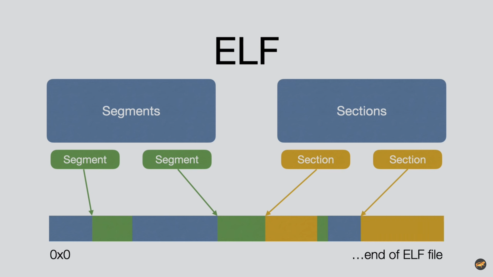

# Creating libraries

* A library is a piece of code that is portable as either a static object/archive file (.a) or a shared object(.so).
  
# What is ELF 🧝?

* Executable and Linkable format (ELF) was introduced in Unix sytem5 in late 80s.
* It is still used in linux , bsd, playstation and wii.
* It is a format mainly used for:
  * Executables
  * Shared libraries
  * Object files

* Each ELF file can contain 0 or more segments and 0 or more sections.
  * Segments are exclusivley used at runtime.
  * Sections are exclusivley used at linktime.
* They both represent data from ELF file. 
* They point to absolute memory address and specify bytes.
* 
* The main difference between sections and segments is that **segments** specify how and where should they be loaded in **virtual or physically memory**.
* So segments determine for OS how to map parts(segments) of ELF file into memory.
> Example: Running an ELF executable
> It has 2 main segments : 
> 1.data  segment (initialized globals and other data)(certain byte range from ELF file at an address which is usually larger than segment itself to sepcify room for uninitialized data) 
> 2.code segment (executable code loaded into memory ,where os loads an address of entry point where binary execution starts).
> shared libraries are mapped similarly however Executable is given 1 extra segment for dynamic linking of shared libraries and which libraries to load.
> Order of addresses is not k fixe here and hence can make memory map quite complex. 

# Difference between .so and .a

* in case of `.so` the ELF(your code) and other ELF(maybe a library) are in same memory space but still are separate ELF and loader will build link between them during runtime.Same for compilation   
> eg: glibc
* in case `.a` (archive/static) is bunch of pre-compiled ELFs(.o files) compressed by some algorithm into an archive.Basically linker takes all ELFs makes into one ELF during compile time. During run time all code is in single binary blob.
  * It can increase size of project due to duplicity. 

# creating libraries

## Creating Static libraries
* create intermediate object file of your src c file
  > gcc -o mylib.o -c mylib.c
* create an archive
  > ar rcs mystatlibrary.a mylib.o 
* move .a archive to main compilation folder
  > mv mystatlibrary.a ../.
* compile the main program with archive and include path
  >gcc -o main main.c mystatlibrary.a -Ilibraryfolderpathwhere headerfileisstored/
* voila !

# Creating shared libraries

* using gcc to compile not an iterobj but a shared library directly using src c file
  `gcc -shared -o libteehee.so lib.c`
* Linking the shared library to the project:
  `gcc -o main main.c -lteehee -L$(pwd)`
> The -l flag is followed by the library name without the lib prefix and .so suffix.
> For example, if your shared library file is named libteehee.so, you should use -lteehee.
> the -L option specifies the directory where the library is located
* Running the program
    * When you run the main executable, the system needs to know where to find libteehee.so. You can do this in a couple of ways:
      * Add the directory to LD_LIBRARY_PATH environment variable:
          ```sh
          export LD_LIBRARY_PATH=$(pwd):$LD_LIBRARY_PATH
          ./main
          ```
      * Copy the shared library to a standard library directory like /usr/lib or /lib (requires root permissions):
        ```sh
        sudo cp libteehee.so /usr/lib
        ./main

        ```