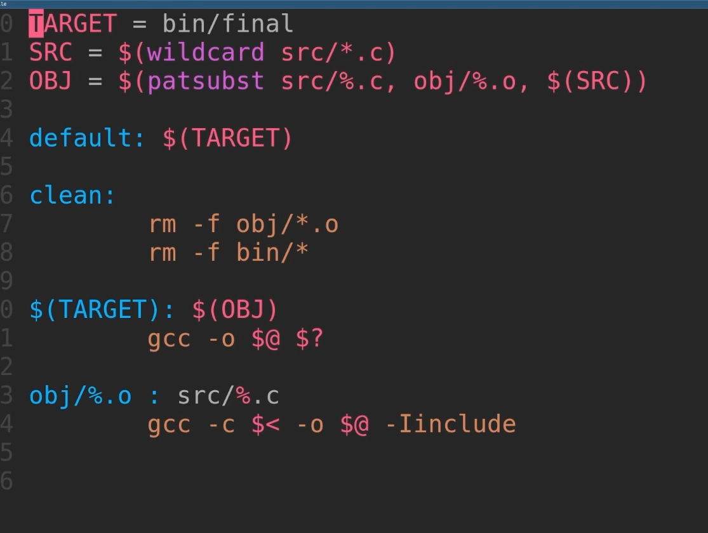
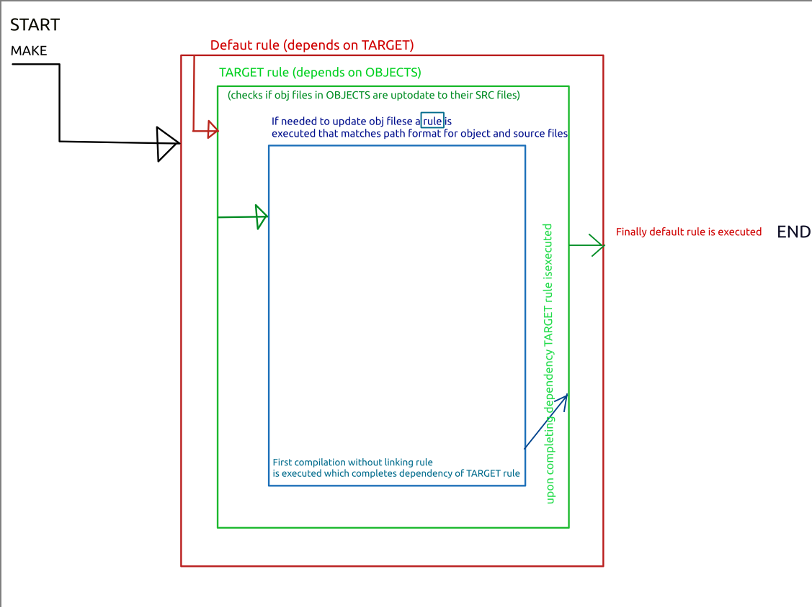

# Make and MakeFile

Compiling and linking modules for our program manually by hand can be tedious and hard. 
**Make** is cmdline utility used to automate this process.
It uses *make language* with it's own syntax to write a  makefile which is essentialy script to automate compilation and linking of modules and testing them as well.

An example makefile

## In the above,
* on left side of `:` is something called rule
* while on right side of `:` is something that is to be built aka our target. 

`default:$(TARGET)` 
> LHS and RHS complete our rule.

* `$(TARGET)` rule specifies another thing to built `$(OBJ)`
 
## Basic Structure of a Makefile
* A Makefile consists of:

  *  Targets: The output files you want to generate (e.g., executables, object files).
  * Dependencies: The files that are needed to create the targets (e.g., source files, header files).
  *  Commands: The commands to be executed to build the targets from the dependencies.

SYNTAX:
target: dependencies
    command
> Make has several special variables that you can use within your rules:
>    `$@: The name of the target.`
>    `$<: The first dependency.`
>    `$^: All dependencies.`
>    `$?: All dependencies that are newer than the target.`


Here is an example of a well-written make file:

```makefile
#specifying compiler to use

CC = gcc

#any compiler flags
CFLAGS = -I./include # including header files

#Source and object files
SRCDIR = src #define src dir
OBJDIR = bin #define bin dir
SOURCES = $(wildcard $(SRCDIR)/*.c) # get all c files in src dir 
OBJECTS = $(patsubst $(SRCDIR)/%.c, $(OBJDIR)/%.o, $(SOURCES)) # change all c files to object files in bin dir from SOURCES list
TARGET = $(OBJDIR)/finalProgram #defining location of final program

#rules
#default rule
default: $(TARGET)

#linking files
$(TARGET): $(OBJECTS)
    $(CC) -o $@ $^ #making an executable from all object files


#compiling

$(OBJDIR)/%.o: $(SRCDIR)/%.c
    $(CC) -c $< -o $@  -I$(CFLAGS) #compiling without linking plus including include header files

#clean rule
clean: 
        rm -f obj/*.o
        rm -f bin/*


```
# Work Flow of Make

;

# Shell function and making sure directories exist beforehand

* The $(shell ...) function in a Makefile allows you to execute shell commands and capture their output. It can be very useful for ensuring that certain prerequisites are met, such as creating directories or capturing output from shell commands to use within the Makefile.

### Syntax
> VARIABLE = $(shell command)

 *   VARIABLE will store the output of the executed command.
    command is any shell command you want to execute.

### Example Usage

    Creating Directories:
    Ensure that the required directories (obj and bin) exist before trying to place files in them.


`$(shell mkdir -p obj bin)`

This command will create the obj and bin directories if they don't already exist. The -p flag ensures that no error is raised if the directories already exist.

> Storing Command Output:
> Capture the output of a shell command to use in the Makefile.

`CURRENT_DIR = $(shell pwd)`
> This command stores the current working directory in the variable CURRENT_DIR.