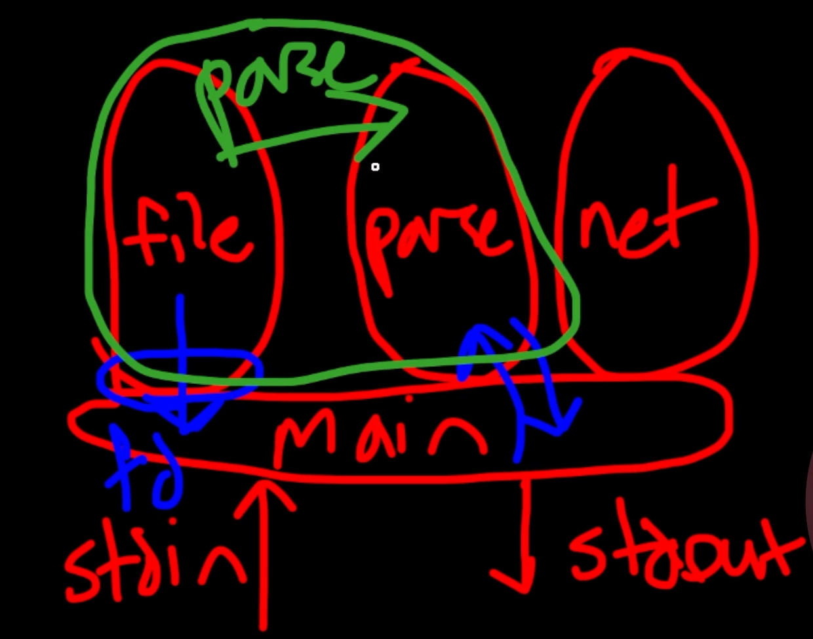
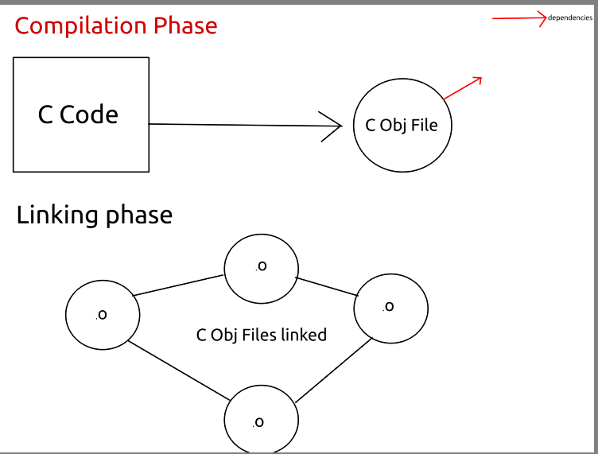

# Multi Module Programming

> Often we include files such as stdio.h  or fnctl.h to utilize functions such as printf or open. This adds a layer of absctraction to our programs.
They act as an API between our programmer and the functionality.


```
                modules
(file api)(parse api)(networking api)
[               main                ]
    ^                            |
    |                            v
stdin                         stdout

```
> so these modules give abstraction to the programme by acting as api interfaces,however it is easy to write something called "spaghetti" code when using these.

```
                modules
(file api)--->(parse api)(networking api)
    |           |
    v           V
[               main                      ]
    ^                            |
    |                            v
stdin                         stdout

```
> In such code every module may depend on their sibling modules that makes it hard to follow the code logically as it is unorganized.Instead if two modules have dependencies on each other , pack them into a single module. 



# Compilation and linking

* When GCC (or some other compiler) is invoked ,Two things happen at this point:
  * Compile phase - all code is compiled into object file.
  * Link Phase(linker pass)- all object files are converted to executables or  
  sometimes even library.

 

 # Header Files

* They act as an API that tells us how to use a library and it's function. Library itself could be closed-source!
* They also define symbol for dependencies to overwrite the explicit function calls warnings.
* They also include a header gaurds that prevents our code from having recursive dependencies

> `#include "myheader.h"`

To get header file functionality working for our code , we have to link our codefile to the library itself using linker flag in gcc:
This method combines both the compilation and linking steps into one command.
Syntax
`<gcc><o flag><outfile><codefile><linker flag><library name><library Flag><libray Path>`
```bash 
$ gcc -o code code.c -lmylibrary -L$(pwd)/lib
```
while this is one way to compile and link our code we can also do it the following way:
* compiling each c file using -c flag(compile only) to get intermediate object files
  > `$ gcc -c -o outfile.o codefile.c` 
* Then gluing them all togethor by invoking the linker
  > `$ gcc -o finalbinary outfile.o outfile1.o `

This method separates the compilation and linking steps, allowing for more control and modularity, especially in larger projects.

💡 In real development environment this is often done using makefiles which will be covered in future lessons

So in sumary ,
* header files include definitions (symbols) of functions and header gaurds  
* While Library file itself has functional code 
* code file ultimatley is compiled with linking of these to files, to produce an executable that has functionality of library. 

**Now** that we know about compiling and linking , lets see how we should structure our project.

* at root level of project say ~/project/. , we have 3 main folders:
  *  **include** - has all the headers file of the project
  *  **src** - has all definition code files
  *  **bin** - has all binary outfiles/executables
  *  **README** - is markdown file, often included as guide or instrucions for project

compilation and linking for a project **manually** in such structure may go as follows:
* make oufiles or itermediate object files with `-c` flag for **every** codefile in src folder.
  ```sh
  $ gcc -o interObjfile.o -I $(pwd)/include src/codefile.c -c
  ```
* Then we combine all compiled intermediate objects int o one binary in bin folder
  ```sh
  gcc *.o -o bin/finalExecutable
  ```
