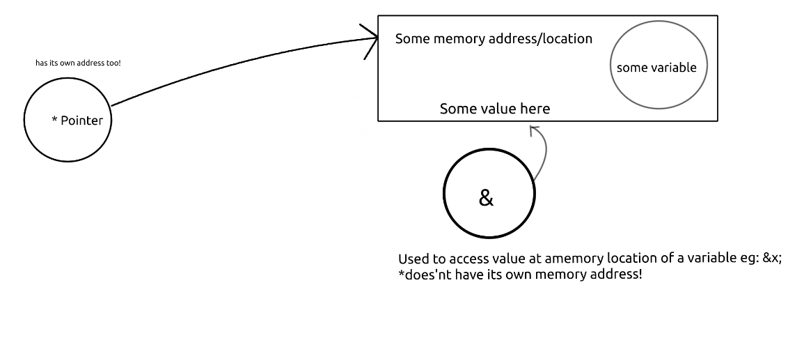

# Pointers* 

* a pointer is a value that happens to be an address(memory location) 
* It points to some memory location(not it's own) as well.

```
int some_var = 4;

int *pointer_to_some_var = &some_var;


```

> here **&some_var** is address of x;

| Symbol        | Funtion                                          | Example    |
| ------------- | ------------------------------------------------ | ---------- |
| some_variable | Holds the value in certain memory location       | int x = 3; |
| *             | Points to memory address of a certain variable   | int *pX;   |
| &             | Holds the value of address of following variable |  &X;       |




# references and De-referencing

<table>
    <tr>
        <th>Symbols</th>
        <th>what it holds/means</th>
    </tr>
    <tr>
        <td>declared variable</td>
        <td>Value of the variable</td>
    </tr>
<tr>
    <td>pointer to the variable(*)</td>
    <td>Value of the variable pointed to</td>
</tr>
<tr>
    <td>Address of the variable(&)</td>
    <td>Memory location of variable(eg:0x7ffe2f14f97c )</td>
</tr>
<tr>
    <td>Pointers name itself(pointer variable)</td>
    <td>Memory of pointer itsled(eg:0x7ffe2f14f97c)</td>
</tr>
</table>

# Why use Pointers?

Pointers help us in scope issues when it comes to using functions with structures.

We use pointers to access out of scope variables in functions by providing pointer pointing to memory address of such variable (or structure).

## Example
```
#include <stdio.h>
#include <stdbool.h>

struct employee_type
{
    int id;
    int income;
    bool staff;
};

void initialize_employee(struct employee_type *e){
    e->id = 0;
    e->income=0;
    e->staff=true;
    
    return;
}
int main(){
    struct employee_type Ralph;    
    initialize_employee(&Ralph);

    printf("%d", Ralph.income);
}
```